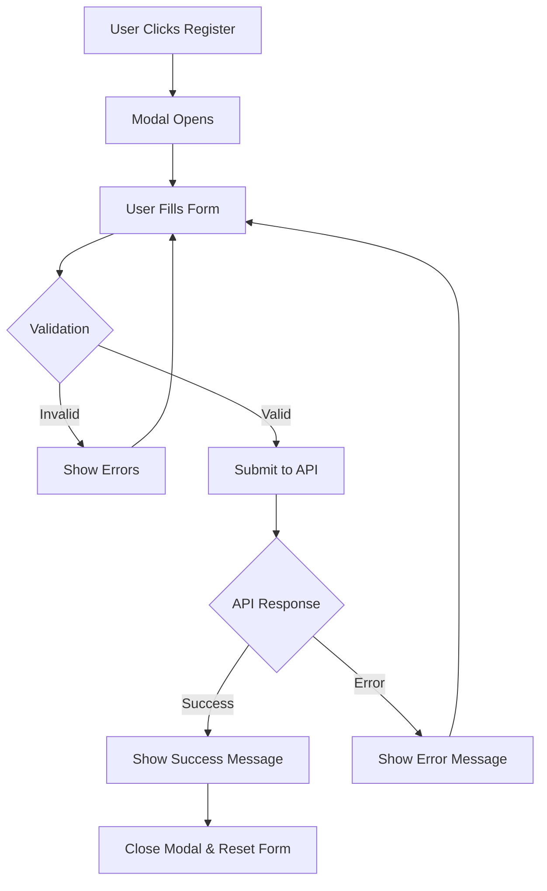

# Event Interest Registration Feature

## Overview

A robust, production-ready event interest registration system built with React Hook Form and Zod validation. This feature allows users to register their interest in upcoming ScholarX events through an elegant modal interface with comprehensive validation and error handling.

## 🎯 Features

- **Smart Form Validation**: Zod schema-based validation with detailed error messages
- **Conditional Fields**: University and Faculty fields appear only for Undergraduate/Graduated students
- **Type Safety**: Full TypeScript support with comprehensive type definitions
- **Responsive Design**: Mobile-first approach with adaptive layouts
- **Accessibility**: ARIA labels, keyboard navigation, and screen reader support
- **User Experience**:
  - Real-time validation feedback
  - Loading states during submission
  - Success/error notifications with SweetAlert2
  - Smooth animations and transitions
  - Form reset on modal close

## 📁 File Structure

```
src/pages/Services/
├── components/
│   ├── ServiceCard/
│   │   ├── ServiceCard.jsx          # Reusable service card component
│   │   └── ServiceCard.css          # Card-specific styles
│   └── EventRegistrationModal/
│       ├── EventRegistrationModal.jsx      # Main modal component
│       ├── EventRegistrationModal.css      # Modal and form styles
│       └── eventRegistrationSchema.js      # Zod validation schema
├── types/
│   └── eventRegistration.types.ts   # TypeScript type definitions
└── Services.jsx                     # Main services page
```

## 🚀 Usage

### Basic Implementation

```jsx
import ServiceCard from "./components/ServiceCard/ServiceCard";
import EventRegistrationModal from "./components/EventRegistrationModal/EventRegistrationModal";
import { FaCalendarAlt } from "react-icons/fa";

function YourComponent() {
  const [isModalOpen, setIsModalOpen] = useState(false);

  const handleSubmit = async (data) => {
    // Your API call here
    console.log("Registration data:", data);

    // Example API call
    const response = await fetch("/api/event-registration", {
      method: "POST",
      headers: { "Content-Type": "application/json" },
      body: JSON.stringify(data),
    });

    if (!response.ok) throw new Error("Registration failed");
  };

  return (
    <>
      <ServiceCard
        icon={FaCalendarAlt}
        title="Upcoming Events"
        description="Register for exclusive events and workshops"
        onRegisterClick={() => setIsModalOpen(true)}
        iconColor="#FF6633"
        iconBgColor="#fff2e6"
      />

      <EventRegistrationModal
        isOpen={isModalOpen}
        onClose={() => setIsModalOpen(false)}
        onSubmit={handleSubmit}
        eventTitle="Workshop Series 2026"
      />
    </>
  );
}
```

## 📋 Form Fields

### Required Fields

| Field           | Type           | Validation                               |
| --------------- | -------------- | ---------------------------------------- |
| Full Name       | Text           | Min 2 chars, max 100 chars, letters only |
| Location        | Text           | Min 2 chars, max 100 chars               |
| Age             | Number         | Must be > 16 and < 120                   |
| Study Level     | Select         | Required selection                       |
| Email           | Email          | Valid email format                       |
| WhatsApp Number | Tel            | Must include country code (+XX format)   |
| Interests       | Multi-checkbox | At least 1, max 8 selections             |

### Conditional Fields (Undergraduate/Graduated only)

| Field      | Type | Validation                            |
| ---------- | ---- | ------------------------------------- |
| University | Text | Min 2 chars, max 100 chars (required) |
| Faculty    | Text | Min 2 chars, max 100 chars (required) |

## 🔧 Validation Schema

The validation is handled by Zod with the following rules:

```javascript
// Age validation
age: z.number()
  .int("Age must be a whole number")
  .min(17, "You must be at least 17 years old")
  .max(120, "Please enter a valid age");

// Phone validation (with country code)
whatsAppNumber: z.string().regex(
  /^\+[1-9]\d{1,14}$/,
  "Include country code (e.g., +1234567890)",
);

// Conditional validation for university/faculty
superRefine((data, ctx) => {
  if (data.studyLevel === "Undergraduate" || data.studyLevel === "Graduated") {
    // University and Faculty become required
  }
});
```

## 🎨 Styling

The components follow the existing ScholarX design system:

- **Primary Color**: `#3399CC`
- **Font Family**: `'Rubik', sans-serif`
- **Border Radius**: `8px` (inputs), `15px` (cards/modals)
- **Transitions**: `0.3s ease` for smooth interactions
- **Responsive Breakpoints**:
  - Desktop: > 992px
  - Tablet: 768px - 992px
  - Mobile: < 768px

### Customization

To customize the ServiceCard appearance:

```jsx
<ServiceCard
  iconColor="#4CAF50" // Icon color
  iconBgColor="#e6ffed" // Icon background
  // ... other props
/>
```

## 📱 Responsive Design

The feature is fully responsive with:

- **Desktop**: Multi-column grid layout
- **Tablet**: Two-column layout with adjusted spacing
- **Mobile**: Single column, full-width inputs, stacked buttons

## ♿ Accessibility

- **Keyboard Navigation**: Full keyboard support (Tab, Enter, Escape)
- **ARIA Labels**: Proper labeling for screen readers
- **Focus Management**: Clear focus indicators
- **Error Announcements**: Error messages linked to inputs
- **Semantic HTML**: Proper heading hierarchy and form structure

## 🔒 Security Considerations

- **Input Sanitization**: All inputs are validated before submission
- **XSS Prevention**: Use proper escaping when displaying user data
- **CSRF Protection**: Implement CSRF tokens in API calls (TODO)
- **Rate Limiting**: Consider adding rate limiting to prevent abuse (TODO)

## 🧪 Testing Checklist

- [ ] Form validation (all fields)
- [ ] Conditional field logic (university/faculty)
- [ ] Successful submission flow
- [ ] Error handling and display
- [ ] Modal open/close behavior
- [ ] Responsive layouts (mobile, tablet, desktop)
- [ ] Keyboard navigation
- [ ] Screen reader compatibility
- [ ] Form reset on close
- [ ] Loading states during submission

## 🔄 Future Enhancements

1. **API Integration**: Connect to backend API endpoint
2. **File Upload**: Add support for document uploads (CV, transcripts)
3. **Multi-step Form**: Break into wizard for complex registrations
4. **Save Draft**: Allow users to save and continue later
5. **Email Verification**: Add email verification step
6. **Social Auth**: Pre-fill data from social login
7. **Analytics**: Track registration funnel and drop-off points
8. **A/B Testing**: Test different form layouts and copy

## 📊 Data Flow



## 🐛 Troubleshooting

### Common Issues

**Issue**: Form doesn't submit

- Check if all required fields are filled
- Verify Zod schema is correctly imported
- Check browser console for validation errors

**Issue**: Conditional fields not appearing

- Verify `studyLevel` value matches exactly ('Undergraduate' or 'Graduated')
- Check `watch()` hook is properly set up

**Issue**: Styling inconsistencies

- Ensure CSS files are imported in correct order
- Check for conflicting global styles
- Verify responsive breakpoints match

## 📚 Dependencies

```json
{
  "react-hook-form": "^7.x.x",
  "zod": "^3.x.x",
  "@hookform/resolvers": "^3.x.x",
  "react-icons": "^5.x.x",
  "sweetalert2": "^11.x.x"
}
```

## 👨‍💻 Development

### Local Development

```bash
# Install dependencies
npm install

# Run development server
npm run dev

# Run linting
npm run lint
```

### Code Style

- Use functional components with hooks
- Follow React best practices and hooks rules
- Maintain consistent naming conventions
- Add JSDoc comments for complex functions
- Keep components focused and single-responsibility

## 📝 License

This feature is part of the ScholarX React application.

## 🤝 Contributing

When contributing to this feature:

1. Follow the existing code style
2. Add proper TypeScript types
3. Include comprehensive error handling
4. Test on multiple devices and browsers
5. Update this README if adding new functionality

## 📧 Support

For issues or questions, please contact the development team or open an issue in the repository.

---

**Built with ❤️ for ScholarX**
